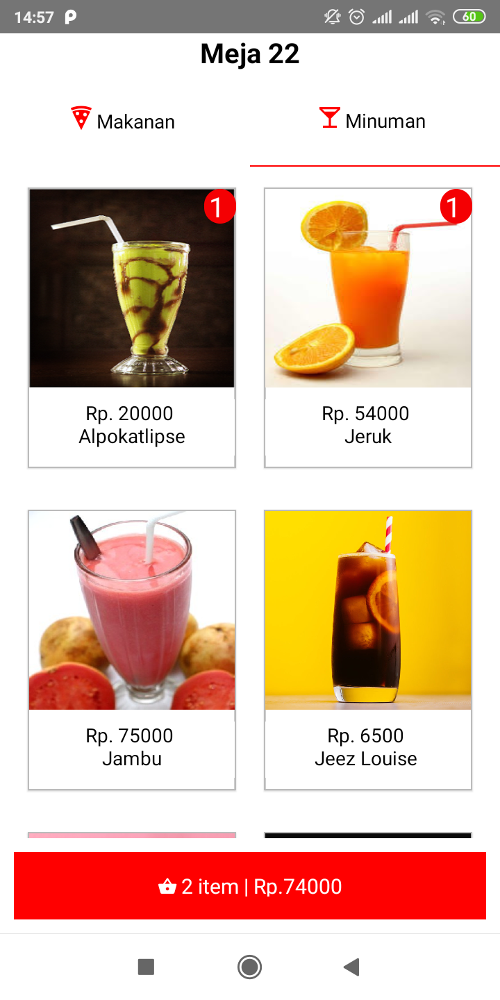
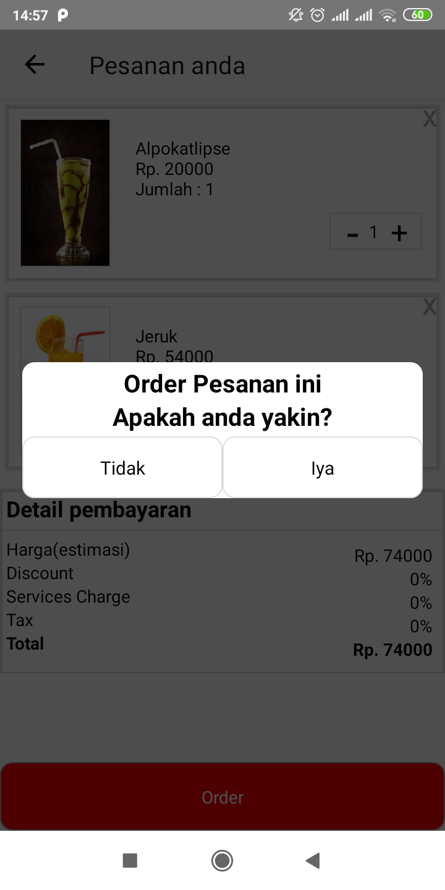

# APLIKASI PEMESANAN MENU KEDAI
Aplikasi pemesanan menu kedai adalah aplikasi berbasis mobile yang bertujuan
mempermudah customer untuk melakukan pemesanan menu pilihan yang tersedia

## SCREENSHOOTS
       

## STACK YANG DIGUNAKAN
- React Native Sebagai Frontend
- Express.js Sebagai backend

## INSTALLASI DAN KONFIGURASI
Ikuti step dibawah ini

### FRONTEND
```
git clone https://github.com/refanfernandoputra/front-end-aplikasi-kedai.git
cd front-end-aplikasi-kedai
npm install
npm start
react-native run-ios #for ios
react-native run-android #for android
```

### BACKEND
```
git clone https://github.com/refanfernandoputra/server-aplikasi-kedai.git
cd server-aplikasi-kedai
npm install
npm install nodemon -D
npm start
```

### CONTACT
- Refan Fernando Putra
  - Wa/Telegram: +62 896 55704793
  - E-Mail: refanfernando@gmail.com
